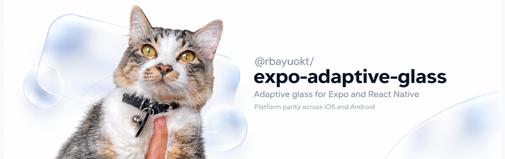
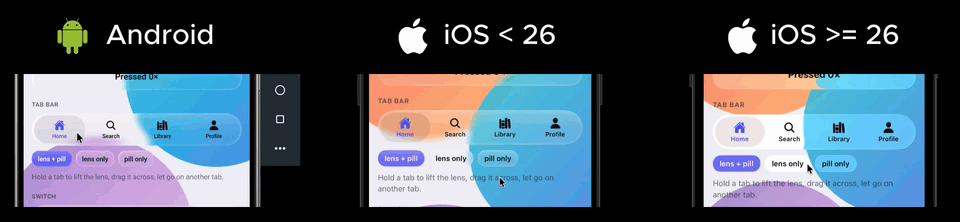

<p align="center">
  
</p>

# Expo Adaptive Glass

<p align="center">
  
</p>

<p align="center">
  <sub><a href="https://drive.google.com/file/d/1fec0-qALdWTe5r8A7KD5pWr7T9kcV6vs/view">Watch the original video</a> in full quality.</sub>
</p>

> The React Native ecosystem has become increasingly iOS-centric, and older iOS versions and
> Android often end up as an afterthought. To me that drifts away from what cross-platform was
> supposed to mean. It should be a consistent experience on every platform, and when a platform
> doesn't have the same API or capability, it deserves a proper fallback, not a worse version of
> an iOS-first design.
>
> It should also be fair to the people using the app. Where I'm from, most people don't carry
> the latest flagship, they use older or budget phones because that's what they can afford.
> They deserve an app that looks good and runs smoothly too, not one that only shines on
> expensive hardware.
>
> So this was built for platform parity and for every budget from the start. iOS 26 gets Apple's
> own glass, and older iPhones and Android phones, including low-end ones, get their own
> implementation of the same look and the same interactions, tuned to what each device can
> actually handle.

Adaptive glass for Expo and React Native. Get the iOS 26 Liquid Glass look on both iOS and
Android, rendered natively. The adaptive part is what sets it apart. Every surface gets as much
glass as the device can draw without dropping frames, so the same code looks right on a new
iPhone and still runs smoothly on an old Android.

Under the hood, one `<GlassSurface>` renders Apple's own glass on iOS 26, live blur with a
refracting AGSL lens on Android 13+, and a clean acrylic material on phones that can't afford
either. You never pick the renderer yourself. The magnifying lenses in the tab bar, switch,
slider and `GlassLens` are real shaders too, Metal on iOS and AGSL on Android, so they bend and
magnify what's underneath instead of just scaling a snapshot, with a thin prism flare along
the rim while you hold them.

***NOT AFFILIATED WITH APPLE OR GOOGLE. ON IOS 26 IT USES APPLE'S PUBLIC GLASS APIS, AND NO
PRIVATE API IS USED ON EITHER PLATFORM.***

## Quick start

### 1. Install

**It needs a development build, not Expo Go.** The library ships native Swift and Kotlin code,
so the app has to be built with it, using `npx expo prebuild`, `npx expo run:ios` /
`run:android` (which prebuild for you) or an EAS Build. There's no config plugin to add and no
permissions to ask for.

```bash
npx expo install @rbayuokt/expo-adaptive-glass@latest
npx expo run:ios        # or run:android, or an EAS build
```

| Where | What you get |
| --- | --- |
| Expo Go | A static translucent `View` and a dev warning saying why |
| Development build / EAS | Everything |
| Bare React Native | Should work once Expo Modules are installed (`npx install-expo-modules`), not tested yet |
| Web | Static translucent fallback |

### 2. Wrap your app once

Put one `GlassProvider` at the very root of your app, above your navigation, and don't nest
another one. Every glass component below it shares its decisions (quality, `clarity`) and the
top layer that `GlassMenu` opens into.

```tsx
// App.tsx
import { GlassProvider } from '@rbayuokt/expo-adaptive-glass';

export default function App() {
  return (
    <GlassProvider>
      <NavigationContainer>{/* your screens */}</NavigationContainer>
    </GlassProvider>
  );
}
```

With Expo Router it goes in the root layout.

```tsx
// app/_layout.tsx
import { GlassProvider } from '@rbayuokt/expo-adaptive-glass';
import { Stack } from 'expo-router';

export default function RootLayout() {
  return (
    <GlassProvider>
      <Stack />
    </GlassProvider>
  );
}
```

`quality` defaults to `'auto'`, which gives full glass on phones that can handle it and steps
down on ones that can't. To always get the best glass, use `<GlassProvider quality="ultra">`
(more in [Auto or forced quality](#auto-or-forced-quality)). These are the modes.

| `quality` | What you get |
| --- | --- |
| `'auto'` (default) | Picks one of the tiers below from the device, and keeps adjusting while the app runs |
| `'ultra'` | The best glass the platform has, with full edge bending and a highlight that follows your finger |
| `'high'` | Same glass, half the edge bending |
| `'medium'` | System glass on iOS 26, plain blur where the phone has it, no bending or moving highlight |
| `'low'` | Acrylic, a frosted fill with no live blur, cheap on any phone |
| `'minimal'` | Flat acrylic, the lightest look |

"The best glass the platform has" is Apple's glass on iOS 26, blur with the AGSL lens on Android
13+, plain blur on Android 12 and older iOS, and acrylic on older Android.

The provider also holds `clarity`, the same idea as Clear and Tinted in iOS 26. It starts at `1`,
clear glass that lets the background through, and `0` is the frosted, tinted look with more
contrast for text sitting on the glass. Anything between works.

```tsx
const [clarity, setClarity] = useState(1);

<GlassProvider clarity={clarity}>{/* your app */}</GlassProvider>;
```

Keeping it in state like that is all you need to wire it to a slider in your own settings
screen, the way the example app does. It applies to every glass below the provider, and a
colour `tint` keeps its colour at any clarity. More in [`<GlassProvider>`](#glassprovider).

Surfaces still render without a provider, they share a default one. But then `GlassMenu` falls
back to a `Modal` and there's nowhere to set anything app-wide, so add it.

### 3. Add glass

Anywhere under the provider, a `GlassSurface` is a `View` made of glass. Put whatever you like
inside it.

```tsx
import { GlassSurface } from '@rbayuokt/expo-adaptive-glass';
import { Text } from 'react-native';

export function Card() {
  return (
    <GlassSurface priority="high" interactive style={{ padding: 16 }}>
      <Text>Hello Glass</Text>
    </GlassSurface>
  );
}
```

### 4. Give Android something to blur

`GlassBackdrop` marks what the glass should blur. iOS blurs whatever is behind a view on its
own, Android can't, its `RenderEffect` blurs a view's own content, so a card would blur its own
text instead of the wallpaper. Without a backdrop, Android glass has nothing to see through and
falls back to the flat acrylic look.

Wrap the background of each screen (the image, gradient or content that sits behind your glass)
in one `GlassBackdrop`, and put the glass next to it, in front, not inside.

```tsx
import { GlassBackdrop, GlassSurface } from '@rbayuokt/expo-adaptive-glass';
import { Image, ScrollView, StyleSheet, View } from 'react-native';

export function HomeScreen() {
  return (
    <View style={{ flex: 1 }}>
      {/* what the glass blurs */}
      <GlassBackdrop style={StyleSheet.absoluteFill}>
        <Image source={wallpaper} style={StyleSheet.absoluteFill} />
      </GlassBackdrop>

      {/* the glass, a sibling in front of the backdrop */}
      <ScrollView>
        <Card />
      </ScrollView>
      <GlassSurface priority="critical" style={styles.tabBar}>...</GlassSurface>
    </View>
  );
}
```

On iOS `GlassBackdrop` is a plain `View`, so the same tree works on both platforms. One per
screen is enough however many surfaces sit on top, it's drawn once per frame and they all
share it. With React Navigation or
Expo Router tabs, `GlassScreenBackdrop` does this for every screen at once, as in step 5.

### 5. Glass bottom tabs with Expo Router or React Navigation

<p align="center">
  
</p>

For a tab app you don't build the bar yourself. The `/navigation` entry has a glass tab bar that
plugs into the bottom tabs navigator, the same one Expo Router's `<Tabs>` uses. Two props do it,
`tabBar` swaps in the glass bar and `screenLayout` wraps every screen in a backdrop, so you can
skip step 4 for tab screens.

With Expo Router, in the tabs layout (the `GlassProvider` stays in the root `app/_layout.tsx`).

```tsx
// app/(tabs)/_layout.tsx
import { Ionicons } from '@expo/vector-icons';
import { GlassNavigationTabBar, GlassScreenBackdrop } from '@rbayuokt/expo-adaptive-glass/navigation';
import { Tabs } from 'expo-router';

export default function TabLayout() {
  return (
    <Tabs
      screenOptions={{ headerShown: false }}
      tabBar={(props) => <GlassNavigationTabBar {...props} />}
      screenLayout={({ children }) => <GlassScreenBackdrop>{children}</GlassScreenBackdrop>}>
      <Tabs.Screen
        name="index"
        options={{ title: 'Home', tabBarIcon: ({ color, size }) => <Ionicons name="home" color={color} size={size} /> }}
      />
      <Tabs.Screen
        name="settings"
        options={{ title: 'Settings', tabBarIcon: ({ color, size }) => <Ionicons name="settings" color={color} size={size} /> }}
      />
    </Tabs>
  );
}
```

With React Navigation it's the same two props on `Tab.Navigator`.

The bar works with nothing else set. When you want it a bit different, `GlassNavigationTabBar`
takes optional props:

```tsx
tabBar={(props) => (
  <GlassNavigationTabBar
    {...props}
    tint="#0a84ff"                    // glass tint, a colour or 'system' | 'light' | 'dark'
    intensity={0.7}                   // how much glass
    lens={false}                      // drop the magnifying lens
    selection="none"                  // nothing marked until a tab is held
    selectionColor="rgba(91,91,240,0.35)"  // colour of the selected pill
    style={{ marginHorizontal: 24 }}  // position of the floating bar
  />
)}
```

Full list in [the tab bar section](#glasstabbar).

```tsx
import { createBottomTabNavigator } from '@react-navigation/bottom-tabs';
import { GlassNavigationTabBar, GlassScreenBackdrop } from '@rbayuokt/expo-adaptive-glass/navigation';

const Tab = createBottomTabNavigator();

export function MainTabs() {
  return (
    <Tab.Navigator
      screenOptions={{ headerShown: false }}
      tabBar={(props) => <GlassNavigationTabBar {...props} />}
      screenLayout={({ children }) => <GlassScreenBackdrop>{children}</GlassScreenBackdrop>}>
      <Tab.Screen name="Home" component={HomeScreen} />
      <Tab.Screen name="Settings" component={SettingsScreen} />
    </Tab.Navigator>
  );
}
```

Icons, labels and badges come from the usual screen options. The bar floats over the screens, so
give scrolling content some bottom padding. It needs React Navigation 7 (or an Expo Router built
on it). The rest is in [React Navigation and Expo Router](#react-navigation-and-expo-router).

## Auto or forced quality

Quality is `'auto'` unless you say otherwise, and that's what makes it adaptive glass. When the
app starts it scores the device from its spec (RAM, OS version, refresh rate, which renderers it
supports, and on Android its performance class) and picks a starting tier. After that, dropped
frames, heat, Low Power Mode and low memory move it down, and it climbs back when things calm
down. On Android that's the difference between blur with the AGSL lens on a strong phone, plain
blur on Android 12, and acrylic on an old one.

There's nothing to set up for auto. If your own UI should follow the same decision, the hook
tells you what it picked.

```tsx
const { quality, downgradeReason } = useGlassQuality();

// e.g. skip a heavy animation when auto has stepped down
const rich = quality === 'ultra' || quality === 'high';
```

Or force a tier and it stops adapting. Pass it to the provider for the whole app, and since
it's just a prop, it can come from state, like a quality picker in your settings screen.

```tsx
const [quality, setQuality] = useState<GlassQuality>('auto'); // or 'ultra' ... 'minimal'

<GlassProvider quality={quality}>{app}</GlassProvider>
```

A single surface can be forced on its own too, `<GlassSurface quality="ultra">`. Forced tiers
still stay inside what the platform can draw, so `ultra` on an old Android is still acrylic.

## Priority (optional)

Every surface is `normal` by default, and that's fine for most apps. `priority` only matters when
a screen has more glass than the phone can draw. Then it decides what keeps its glass and what
steps down first.

```tsx
<GlassSurface priority="critical">{/* tab bar, keeps its glass longest */}</GlassSurface>
<GlassSurface priority="decorative">{/* background blobs, first to go flat */}</GlassSurface>
```

The order is `critical` → `high` → `normal` → `low` → `decorative`. Surfaces with the same
priority move together, so a list never ends up half glass and half acrylic.

## Why use it

- **It's the real thing on iOS 26.** Surfaces use Apple's `UIGlassEffect`, not a blur made to
  look like it, so they match the system UI. `clarity` switches them to Apple's clear style.
- **It won't tank your frame rate.** Each surface costs budget by its size and priority. When
  a screen has more glass than the device can draw, the less important surfaces step down
  first, so a nav bar stays glass while a long list of cards goes flat together.
- **It watches the device, not just the model name.** Measured frame times, thermal state, Low
  Power Mode and memory pressure all lower the tier, and it climbs back with a delay so it
  doesn't flap between tiers.
- **Scrolling stays still.** While a list moves, allocations are frozen and re-planned only
  once it stops, so cards don't swap material mid-scroll.
- **Accessibility settings are respected.** Reduce Transparency switches to an opaque
  material, Reduce Motion turns off the springs and lens motion.
- **It degrades instead of breaking.** Expo Go and web get a static translucent view, and an
  AGSL shader that fails to compile falls back to plain blur.

## What's in the kit

- `GlassTabBar` lifts the selected pill into a magnifying lens you can drag onto another tab
- `GlassSwitch` and `GlassSlider` turn the thumb into a clear lens while you hold it
- `GlassMenu` is a round button that grows into a menu, with nested submenus and press-drag-release to pick
- `GlassLens` magnifies whatever is under your finger when you hold any content
- `GlassGroup` melts nearby glass together and stretches it apart as it moves
- `draggable` on any surface, and a global `clarity` from frosted to clear, like the iOS 26 setting
- A drop-in tab bar for React Navigation and Expo Router
- Hooks to read the current tier, capabilities and live frame stats

Touches, springs and the lens run in Swift and Kotlin, so nothing here needs Reanimated or
Gesture Handler, and no animation waits on the JS thread.

## Tech stack

| Layer | What it uses |
| --- | --- |
| JS API | TypeScript, React hooks, `useSyncExternalStore` so a surface only re-renders when its own allocation changes |
| Quality policy | Plain TypeScript in `src/quality/`, no React or native imports, covered by Jest |
| Native bridge | Expo Modules API (Swift and Kotlin DSL), one module per native view |
| iOS glass | `UIGlassEffect` and `UIGlassContainerEffect` on iOS 26, `UIVisualEffectView` blur materials before that, Core Animation layers for tint, rim and highlight |
| iOS lens | Metal, a fragment shader compiled from source at runtime |
| iOS timing | `CADisplayLink`, `ProcessInfo` thermal and power state, `UIAccessibility` |
| Android glass | `RenderNode` and `RenderEffect` blur (API 31+), AGSL `RuntimeShader` (API 33+), `Paint` and gradients for acrylic |
| Android timing | `Window.OnFrameMetricsAvailableListener`, `PowerManager` thermal and power-save state, `onTrimMemory` |
| Motion | Hand-rolled critically damped springs on both platforms, driven by `postOnAnimation` on Android and a display link on iOS |
| Navigation | Optional `@rbayuokt/expo-adaptive-glass/navigation` entry for React Navigation 7 bottom tabs and Expo Router |
| Example app | Expo SDK 57, Reanimated 4, React Navigation 7, expo-image, expo-linear-gradient, @expo/vector-icons |

Native code measures and draws. It never decides a tier. Every decision comes from the
TypeScript policy, which is why the whole thing is testable without a device.

## Renderers

| Platform | Renderer | Drawn with |
| --- | --- | --- |
| iOS 26+ | `system` | `UIGlassEffect`, corners through `cornerConfiguration` |
| iOS 15.1 to 25, or apps setting `UIDesignRequiresCompatibility` | `nativeBlur` | `UIBlurEffect` materials plus tint, sheen and rim layers |
| Android 13+ | `shaderGlass` | Backdrop `RenderNode` → blur `RenderEffect` → AGSL lens |
| Android 12 | `nativeBlur` | Backdrop `RenderNode` → blur `RenderEffect` |
| Android 11 and older, or `isLowRamDevice()` | `acrylic` | Semi-opaque fill, sheen, gradient hairline, static highlight |

`acrylic` is also every platform's low tier. If the AGSL shader fails to compile, the surface
drops to plain blur and stays there instead of crashing.

## Components

### `<GlassProvider>`

| Prop | Default | Does |
| --- | --- | --- |
| `quality` | `'auto'` | `'auto'` adapts. Any tier (`'ultra'` to `'minimal'`) pins every surface and stops adapting |
| `maxLiveSurfaces` | none | Cap on surfaces with live blur. The tier's own limit (12 / 10 / 6 / 0 / 0) still applies |
| `adaptivePerformance` | `true` | React to measured frame times |
| `respectLowPowerMode` | `true` | Cap at `medium` in Low Power Mode and Battery Saver |
| `respectReduceTransparency` | `true` | Opaque material when the setting is on |
| `clarity` | `1` | `1` clear to `0` frosted, for every glass inside, like the Clear and Tinted setting in iOS 26 |

It's optional. Surfaces outside a provider share one with these defaults.

`clarity` thins the tint, sheen and blur on everything at once, so an app can offer the same
choice as iOS 26 Settings from one state value:

```tsx
const [clarity, setClarity] = useState(1);

<GlassProvider clarity={clarity}>
  <App />
</GlassProvider>
```

Glass starts clear, like iOS 26 does out of the box. Pass `clarity={0}` for the frosted, tinted
look, or anything in between. From `0.5` the iOS 26 system glass switches to Apple's own clear
style. iOS 15 to 25 blurs less and less, and Android's blur radius drops to a bit under half at
`1`. Some blur always stays, so clear glass still softens what's behind it and catches the light
at its edges. Acrylic has no blur under it, so it only clears partway.
A colour `tint` holds its colour at any clarity. Clarity clears the neutral frost, and a tinted
surface gets a little stronger as it clears, since a sharper background would otherwise drown it
out. Clear glass with `tint="#0a84ff"` is still clearly blue. Components that put text on a tinted surface can read
the value with `useGlassClarity()`.

### `<GlassSurface>`

| Prop | Default | Does |
| --- | --- | --- |
| `priority` | `'normal'` | `'critical'`, `'high'`, `'normal'`, `'low'` or `'decorative'`, who keeps live glass when the budget runs out |
| `quality` | `'auto'` | Pin this one surface to a tier. Platform limits still apply |
| `intensity` | `0.6` | How strongly tint and sheen read, 0 to 1 |
| `tint` | `'system'` | `'system'`, `'light'`, `'dark'` or any color |
| `cornerRadius` | `24` | Anything over half the short side becomes a capsule |
| `refraction` | `true` | Allow edge bending where the tier has it |
| `interactive` | `false` | Native press: swell, lean toward the finger, light under it |
| `draggable` | `false` | Follows the finger natively and springs back on release. A scroll view around it waits for the drag |
| `onInteractionStart` / `onInteractionEnd` | | Once per press |
| `onDragStart` / `onDragEnd` | | Once per drag. `onDragEnd` gets `{ x, y }`, the release offset in points |
| `style` | | Size, padding and layout, like any `View`. The shape comes from `cornerRadius` |

Plus normal `View` props. Children are ordinary React Native views, so `Text`, `Pressable` and
`expo-image` work as usual. Touch coordinates never go through JS.

The press and the drag are transforms on an inner native view (`setAnimationMatrix` on
Android), so your own `transform` style is left alone and nothing gets re-blurred per frame.
Everything settles on critically damped springs: smooth, no bounce. A press ends when the
finger lifts or when a list around it starts scrolling. `UIGlassEffect.isInteractive` isn't
used because it never reacted with React Native content inside the glass on iOS 26.1.

### `<GlassBackdrop>`

```tsx
<GlassBackdrop style={StyleSheet.absoluteFill}>
  <Image source={wallpaper} style={StyleSheet.absoluteFill} />
</GlassBackdrop>
```

Marks what glass on Android should blur, see [step 4 of the quick start](#4-give-android-something-to-blur).
It takes the same props as a `View`. Glass goes next to it, in front, never inside it. On iOS
it's a plain `View`.

### `<GlassTabBar>`

```tsx
<GlassTabBar selectedIndex={tab} onSelect={setTab}>
  {tabs.map((t, i) => (
    <View key={t.label} style={{ alignItems: 'center' }}>
      <Ionicons name={t.icon} size={22} color={i === tab ? accent : text} />
      <Text>{t.label}</Text>
    </View>
  ))}
</GlassTabBar>
```

The selected tab sits on a soft pill that fills its slot, or grows past it when a long label needs
the room, so there's always at least 14 pt around the icon and label. Hold the bar and the pill lifts into a
clear lens about 1.18× the bar's height, spilling over the top and bottom. The middle of the lens
magnifies what's under it (1.2×), the rim bends it like the edge of real glass, and the whole bar
swells a little. Drag and the lens follows, stretching with speed. Let go and it shrinks back
into the pill on the nearest tab. JS hears `onSelect(index)` once, on release.

| Prop | Default | Does |
| --- | --- | --- |
| `selectedIndex` | | Controlled selection |
| `onSelect` | | Called with the new index |
| `tint` | `'system'` | Same as `GlassSurface` |
| `cornerRadius` | `999` | Capsule |
| `intensity` | `0.7` | Background glass intensity |
| `lens` | `true` | `false` skips the magnifying lens |
| `selection` | `'pill'` | What marks the selected tab at rest. `'none'` leaves it unmarked until it's held |
| `selectionColor` | | Colour of that mark, used as given. Leave it out for the translucent default |

How the lens is drawn:

- Android replays the tab items' existing display lists into a capsule `RenderNode` at the lens
  scale. Android 13+ runs the AGSL lens over it (bending band about 28% of the height, slight
  colour fringe). Android 9 and older use a clipped canvas.
- iOS renders the tab row to a Metal texture once per press, then only the shader's uniforms
  change while the lens moves. Same lens profile as Android. Without refraction, or without
  Metal, it falls back to a scaled `snapshotView`.
- `lens={false}` turns the lens off for good and leaves the plain highlight behind the selected
  tab. `selection="none"` drops that highlight instead and keeps the lens, so the bar marks
  nothing until a tab is held. Both off means the icon colour is the only cue.
- `selectionColor` paints that highlight, alpha included, in place of the translucent white or
  black. It follows `tint` when you leave it out, so the default bar is unchanged.
- The magnified copy stays opaque while the lens settles, shrinking onto the real tabs, so
  nothing blinks on release.
- The lens is cheap, so it shows on every tier except `minimal`. Bending only runs where
  refraction is on (`high` and `ultra`). `minimal`, Reduce Transparency and Reduce Motion get
  the plain sliding pill.

### React Navigation and Expo Router

`@rbayuokt/expo-adaptive-glass/navigation` has a ready-made tab bar for React Navigation's bottom tabs.
Expo Router's `<Tabs>` is built on the same navigator, so it works there too:

```tsx
// app/(tabs)/_layout.tsx
import { Tabs } from 'expo-router';
import { GlassNavigationTabBar, GlassScreenBackdrop } from '@rbayuokt/expo-adaptive-glass/navigation';

export default function TabLayout() {
  return (
    <Tabs
      screenOptions={{ headerShown: false }}
      tabBar={(props) => <GlassNavigationTabBar {...props} />}
      screenLayout={({ children }) => <GlassScreenBackdrop>{children}</GlassScreenBackdrop>}>
      <Tabs.Screen
        name="index"
        options={{ title: 'Home', tabBarIcon: ({ color, size }) => <Ionicons name="home" color={color} size={size} /> }}
      />
      <Tabs.Screen name="library" options={{ title: 'Library', tabBarBadge: 3 }} />
    </Tabs>
  );
}
```

With plain React Navigation it's the same two props on `Tab.Navigator`.

- It reads the screen options you'd use with the stock bar: `title`, `tabBarLabel`,
  `tabBarIcon`, `tabBarBadge`, `tabBarShowLabel`, `tabBarActiveTintColor`,
  `tabBarInactiveTintColor`, `tabBarAccessibilityLabel` and `tabBarButtonTestID`.
- It fires `tabPress` before navigating, so `preventDefault` in a listener works, and a tap on
  the current tab still sends it (handy for scroll-to-top).
- The bar floats over the screens and sits above the bottom safe-area inset. Give scrolling
  content some bottom padding so the last rows can scroll out from under it. Pass `style` to
  change its position, `tint` and `intensity` for the glass, `lens={false}` to drop the
  magnifier, `selection="none"` to drop the resting highlight and `selectionColor` to paint it.
- `screenLayout` with `GlassScreenBackdrop` is what makes the bar blur the screens on Android
  (see [step 4 of the quick start](#4-give-android-something-to-blur)). On iOS it's a plain `View`, so
  leaving it out only costs the Android blur. `screenLayout` needs React Navigation 7 or an
  Expo Router built on it.

The entry point doesn't import React Navigation, so apps without it don't pay for it. The
example's **Nav** tab runs a real bottom-tabs navigator with this bar.

### `<GlassGroup>`

```tsx
<GlassGroup spacing={20} style={{ flexDirection: 'row', gap: 40 }}>
  <GlassSurface cornerRadius={40} style={{ width: 80, height: 80 }} />
  <GlassSurface draggable cornerRadius={40} style={{ width: 80, height: 80 }} />
</GlassGroup>
```

Surfaces in a group melt into one shape when they get within `spacing` of each other and pull
apart through a stretching bridge when they separate. There's nothing to call: drag a
`draggable` surface into another, press an `interactive` one so it leans over, or move surfaces
with Reanimated or layout, and the group follows them natively every frame. Members can be at
any depth inside the group.

| Prop | Default | Does |
| --- | --- | --- |
| `spacing` | `20` | How close two surfaces get before they merge |
| `tint` / `intensity` | `'system'` / `0.6` | Used where the group draws the merged glass itself |

| Platform | How it merges | Cost |
| --- | --- | --- |
| iOS 26 | Apple's `UIGlassContainerEffect` | Nothing extra |
| Android 13+ | One AGSL pass: smooth union of the members' rounded rects over the shared blurred backdrop | GPU, only over the members' bounds |
| iOS 15 to 25 | Same smooth union as a small CPU-drawn mask over one blur view | Half resolution, only in frames where a member moved |
| Android 12 and older | No merge | Same as plain surfaces |

Up to eight members merge on Android. On iOS, don't animate the opacity of a view that holds
glass, `UIVisualEffectView` stops rendering inside it. Fade the content instead.

### `<GlassSwitch>`

```tsx
<GlassSwitch value={wifi} onValueChange={setWifi} onColor="#0a84ff" />
```

A controlled switch with the iOS 26 press. Holding it turns the white thumb into a larger glass
lens that sits over the track, dragging moves it while the track blends from off to `onColor`,
and letting go settles it on the nearer side. A tap flips it. The lens is clear: the track shows
through at its own size and only the rim bends it.

| Prop | Default | Does |
| --- | --- | --- |
| `value` | | On or off |
| `onValueChange` | | Called with the new value after a tap or a drag |
| `disabled` | `false` | Dims it and ignores touches |
| `onColor` | system green | Track colour when on |

It's 64 × 28 by default, pass `style` to resize it. The `minimal` tier and Reduce Motion skip the
lens. Without the native module, in Expo Go for example, it renders React Native's `Switch`.

### `<GlassSlider>`

```tsx
<GlassSlider value={volume} onValueChange={setVolume} step={0.05} fillColor="#5e5ce6" />
```

The same idea as `GlassSwitch`: the white thumb swells into a clear lens over the track while
it's held, follows the finger, and settles back into the thumb on release. A touch off the thumb
jumps it there first.

| Prop | Default | Does |
| --- | --- | --- |
| `value` | | Current value |
| `minimumValue` / `maximumValue` | `0` / `1` | Range |
| `step` | `0` | `0` is continuous. `onValueChange` only fires when the stepped value changes |
| `onValueChange` | | While dragging |
| `onSlidingComplete` | | On release |
| `disabled` | `false` | Dims it and ignores touches |
| `fillColor` | system blue | The filled part of the track |

It stretches to its parent's width and is 44 tall by default. The `minimal` tier and Reduce
Motion skip the lens. React Native has no slider to fall back to, so without the native module
(Expo Go) it renders nothing.

### `<GlassLens>`

```tsx
<GlassLens>
  <Image source={photo} style={{ height: 160 }} />
  <Text>Small print</Text>
</GlassLens>
```

Hold anywhere on the content for a moment and a clear lens grows out of the finger and
magnifies what's under it. It follows the drag and sinks back into the finger on
release. The hold is short (0.15 s), so a scroll view around it still scrolls on a swipe.

| Prop | Default | Does |
| --- | --- | --- |
| `lensWidth` / `lensHeight` | `96` / `64` | Lens size in points. Equal values make a circle |
| `magnification` | `1.4` | Zoom at the lens center |
| `lift` | `0` | Floats the lens this many points above the finger, so the finger doesn't cover it |
| `disabled` | `false` | No lens |

The lens reads the content once per press, so it shows what was there when the hold started.
Android replays the children's display lists, iOS takes one capture. Edge bending follows the
`refraction` capability, and the `minimal` tier or a missing native module renders a plain `View`.

### `<GlassMenu>`

```tsx
<GlassMenu
  trigger={<Ionicons name="ellipsis-horizontal" size={20} />}
  items={[
    { label: 'Select chats', icon: <Ionicons name="checkmark-circle-outline" size={20} />, onPress: select },
    {
      label: 'Sort by',
      items: [
        { label: 'Newest', onPress: sortNewest },
        { label: 'Unread first', onPress: sortUnread },
      ],
    },
    { label: 'Delete all', destructive: true, onPress: deleteAll },
  ]}
/>
```

A round glass button that grows into a glass menu, like the iOS 26 `...` menus. One glass shape
springs from the button to the panel while the icon fades out and the items fade in. An item with
`items` opens a submenu in the same panel, which resizes to fit, with a back row on top. Tapping
outside or picking an item closes it back into the button, Android's back button goes up one
level.

| Prop | Default | Does |
| --- | --- | --- |
| `trigger` | | What the button shows, usually an icon |
| `items` | | See the item table below, nest `items` as deep as you like |
| `size` | `44` | Button diameter |
| `width` | `250` | Panel width |
| `maxHeight` | half the screen | Tallest the panel gets before the list scrolls |
| `tint` | `'system'` | Same values as `GlassSurface` |
| `labelStyle` | | Text style for every row, font family included |
| `onOpen` / `onClose` | | Called when the menu opens and when it's fully closed |
| `style` | | Style of the button's wrapper, for margins and placement |
| `accessibilityLabel` | | What screen readers say for the button, needed when it's only an icon |

Each item:

| Key | Does |
| --- | --- |
| `label` | Row text |
| `icon` | Anything, drawn before the label |
| `onPress` | Runs on pick, unless the item has `items` |
| `items` | Opens a submenu in the same panel |
| `destructive` | Red label, for deletes |
| `disabled` | Dimmed, picking it does nothing |
| `selected` | Shows a checkmark, for rows that act like a choice |
| `separator` | Hairline under the row, to group the ones above |
| `labelStyle` | Text style for this row, on top of the menu's |

Long press the button and the menu opens under your finger. Keep the finger down and drag
through the rows, a highlight slides to the row under it with a light haptic tick, and letting
go picks that row. Release without moving and the menu just stays open. Once it's open, pressing
and sliding works the same way. Pull past the edge and the panel stretches after your finger
like jelly, then wobbles back when you let go. All of this is tracked natively, JS only hears
the row that was picked.

Rows are 44pt at font scale 1 and grow with the system text size, up to 1.6x. A list taller than
the screen scrolls instead, and a scrolling panel gives up the native drag, so rows are tapped
and the highlight doesn't follow the finger.

The panel opens from the button's corner nearest the middle of the screen and stays on screen.
It draws in a layer that `GlassProvider` keeps above the app, so it isn't clipped by the button's
parent. Without a provider it falls back to a transparent `Modal`, which on Android can't blur
the app behind it.

React Native lays the panels out once. The morph itself runs natively each frame on the same
glass view as `GlassSurface`, with the same renderers and quality tier. With Reduce Motion the
shape jumps and only the content fades.

### Hooks

| Hook | Returns | Re-renders |
| --- | --- | --- |
| `useGlassQuality()` | `{ quality, requestedQuality, renderer, downgradeReason }` | When the tier or reason changes |
| `useGlassCapabilities()` | Renderer, live blur, refraction, blur radius, live surface cap, shader quality, refresh rate | When the tier changes |
| `useGlassPerformance()` | Frame times, dropped ratio, fps, visible surfaces and area, thermal, power, memory, accessibility, scroll state | About twice a second, meant for dev screens |
| `useGlassClarity()` | The provider's `clarity`, `0` to `1` | When the provider's value changes |

`getGlassDeviceInfo()` returns the static facts the policy starts from (RAM, OS, screen,
refresh rate, renderer support), or `null` without the native module.

## How quality is picked

Device score → thermal, power and memory caps → frame feedback → per-surface budget → scroll
and accessibility tweaks → native props.

**Device score.** 0 to 100 from RAM, OS version, the best renderer available, max refresh rate
and a generation hint (`MEDIA_PERFORMANCE_CLASS` on Android, core count on iOS). There's no
device model table. `isLowRamDevice()` costs 30 points and forces `acrylic`.

**Caps.** Thermal `fair` caps at `high`, `serious` at `medium`, `critical` at `low`. Low Power
Mode caps at `medium`. A memory warning caps at `low` for 30 seconds.

**Frame feedback.** Native code sums frames into windows of about 500 ms and sends one summary
per window, never per-frame data. A window counts as stressed when frames average over 1.25×
the target or more than 10% drop. Two stressed windows in a row drop a tier. Climbing back takes
4 s of calm, one tier at a time, and an upgrade that fails within 10 s doubles the next wait (up
to 60 s). It never pushes below `low` and ignores frames while no glass is visible. The target
comes from the display itself, so 60, 90 and 120 Hz all just work.

**Budget.** Native code measures each surface's visible area. Cost grows with area, renderer and
tier, plus a small per-surface overhead, so twenty small buttons cost less than one fullscreen
sheet. Surfaces with the same priority always get the same tier, so cards in a list never mix
glass and acrylic: if twelve cards can't all be live, none of them are. While anything scrolls,
allocations are frozen and the re-rank waits until motion stops. Offscreen surfaces cost
nothing, and an open `GlassMenu` isn't counted either, so opening one never changes the glass
behind it.

**Tweaks.** Fast scrolling turns off refraction and the moving highlight but keeps the blur.
Reduce Motion pins the highlight and turns off the spring motion. Reduce Transparency switches
everything to an opaque material.

| Tier | Renderer | Refraction | Moving highlight | Blur | Live surfaces |
| --- | --- | --- | --- | --- | --- |
| `ultra` | best available | full | yes | 28 dp | 12 |
| `high` | best available | half | yes | 25 dp | 10 |
| `medium` | system or native blur | off | no | 21 dp | 6 |
| `low` | acrylic | off | no | none | 0 |
| `minimal` | flat acrylic | off | no | none | 0 |

Refraction goes first, then the moving highlight, then blur strength, and acrylic comes last.
Tier changes cross-fade in about 300 ms. All the numbers live in `POLICY` in
`src/quality/policy.ts` and none of them come from benchmarks yet.

## Lists

`FlatList`, `FlashList`, `ScrollView` and grids need nothing special. Give navigation
`priority="critical"` and leave cards on `normal`, so the bar keeps its glass while the cards
step down. On Android put the list and the bars over one `GlassBackdrop`, not one per row.
Cards blur the backdrop, not the list content next to them.

## Accessibility

- Reduce Transparency (iOS) turns every surface into a near-opaque fill with a stronger edge.
  Android has no equivalent setting to read.
- Reduce Motion (iOS, or Android's "Remove animations") pins the highlight and stops the spring
  motion and the lens.
- Tints follow light and dark mode, and highlights are mixed from the tint rather than plain
  white.
- `GlassMenu` rows grow with the system text size, up to 1.6x, and every row is a menu item for
  screen readers with its disabled and selected state.

## Lifecycle and cost

- The iOS display link and the Android frame listener only run while JS is listening, the app is
  in the foreground and some glass is on screen. Idle UI costs nothing on Android.
- Backgrounding stops monitoring. Coming back re-reads thermal, power and accessibility state.
- Android surfaces drop their blur node when detached. Blur effects are shared through a small
  cache keyed by radius, and each AGSL shader compiles once and only rebuilds its effect when a
  uniform changes.
- The spring loops stop as soon as they settle.

## Example app

`example/` is an Expo SDK 57 app that links the library from the repo root.

```bash
npm install
npm run example:ios       # or example:android
```

The bottom bar is the library's own `GlassTabBar`.

| Tab | Shows |
| --- | --- |
| Home | Demo sections in a glass bar at the top: Basics, Merge, Nav, Many, Scroll, Stress, Quality, A11y |
| Playground | One live surface with controls for every prop, and the JSX to copy |
| Benchmark | Timed runs over 1 to 30 surfaces, or **Run all** for every renderer and count |
| Inspect | Device facts and runtime state |
| Settings | Global glass settings (Tinted / Clear, a clarity slider, quality, the provider toggles) and About |

Inside Home, Basics has the tab bar lens with a lens / pill / colour switcher, switches, three
`GlassMenu`s (nested submenus, checkmarks, a disabled row, separators and styled labels, plus a
24 row menu that scrolls) and a `GlassLens` over a photo. Merge has joining, splitting, a draggable
circle and a detaching + button, and Nav runs a real React Navigation bottom-tabs navigator with
`GlassNavigationTabBar`.

## Troubleshooting

**Flat surfaces and a "native module not found" warning.** You're in Expo Go, or the app wasn't
rebuilt after installing. Run `npx expo run:ios` or `run:android`.

**Acrylic on Android where you expected blur.** The surface needs a `GlassBackdrop` behind it,
as a sibling. `useGlassPerformance().liveSurfaceCount` shows how many surfaces are really
drawing live glass.

**Blur instead of system glass on iOS 26.** The app sets `UIDesignRequiresCompatibility`, or it
was built with an Xcode older than 26.

**Everything dropped to `low`.** Check `downgradeReason`. `thermal`, `lowPower` and `lowMemory`
come from the OS. `framePerformance` means frames dropped while glass was visible, whatever
caused it. Pin `quality="high"` on the provider to rule the adaptation out.

**A list blanks for one frame while scrolling on iOS.** Look for text next to the list that
updates while it scrolls, like a counter or the diagnostics panel. If its height changes by a
fraction of a point, the list moves mid-scroll and Fabric can draw an empty frame. It happens
without glass too. Give live text a fixed `lineHeight`.

**A background color on `GlassSurface` covers the glass.** On Android the surface is the native
view, so its own background paints over the glass. Put colors on the children or use `tint`.

## Limitations

- Android live blur needs a `GlassBackdrop`, and only what's inside it gets blurred.
- Android has no Reduce Transparency setting.
- iOS below 26 can't read the pixels behind a view, so surfaces there get rim, light and motion
  but no edge bending. The lenses (tab bar, switch, slider, `GlassLens`) are the exception,
  they bend their own texture with Metal.
- Android press and drag motion need API 29. Older devices keep the highlight only.
- `draggable` always springs back. A surface left where it was dropped would stop receiving
  touches, since React Native doesn't know it moved. Move surfaces with Reanimated if they need
  to stay put.
- iOS frame timing only sees GPU trouble once it delays the app.
- iOS below 26 has no blur radius API. The blur is parked part of the way through a paused
  `UIViewPropertyAnimator`, which is public API, and re-parked when the app returns from the
  background.
- No native drop shadow, it would show through the glass. Use React Native shadow styles.
- Only the New Architecture has been run.
- The scoring weights and budget are guesses until they're measured on real devices.

## Architecture

```text
src/
  quality/
    policy.ts                 every constant, scoring, renderer mapping, cost, allocation
    QualityController.ts      frame-driven tier with hysteresis and upgrade backoff
    GlassQualityManager.ts    surface registry, caps, reasons, snapshots for the hooks
  GlassProvider.tsx
  GlassSurface.tsx
  GlassBackdrop.tsx
  GlassTabBar.tsx
  GlassGroup.tsx
  GlassSwitch.tsx
  GlassSlider.tsx
  GlassLens.tsx
  GlassMenu.tsx
  overlay.tsx                   top layer for menus, mounted by GlassProvider
  navigation/                   GlassNavigationTabBar, GlassScreenBackdrop
  hooks/
ios/
  ExpoAdaptiveGlassView.swift   surface: glass, RN children, press and drag, GlassMenu morph and touch
  GlassLensView.swift           tab bar lens and its springs
  GlassGroupView.swift          merging
  GlassSwitchView.swift         switch with the lens thumb
  GlassSliderView.swift         slider with the lens thumb
  GlassMagnifierView.swift      GlassLens
  renderers/                    system glass, blur, acrylic layers, Metal lens
  performance/                  display link monitor, capability detector
android/src/main/java/expo/modules/adaptiveglass/
  ExpoAdaptiveGlassView.kt      surface: draws glass before its RN children, GlassMenu morph and touch
  GlassPressMotion.kt           press and drag springs
  GlassBackdropView.kt          shared backdrop RenderNode
  GlassLensView.kt              tab bar lens
  GlassGroupView.kt             merging
  GlassSwitchView.kt            switch with the lens thumb
  GlassSliderView.kt            slider with the lens thumb
  GlassMagnifierView.kt         GlassLens
  renderers/                    AGSL lens, AGSL merge, blur, acrylic
  performance/                  FrameMetrics monitor, capability detector
```

The native view hosts its React Native children on both platforms. On Android that keeps them
out of the backdrop recording, so the glass never blurs its own text. On iOS it lets the press
and drag move glass and content together.

## Scripts

| Command | Does |
| --- | --- |
| `npm run build` | `tsc` into `build/`, watches in a terminal |
| `npm run prepare` | One clean build |
| `npm test` | Jest: scoring, renderer choice, cost, allocation, hysteresis, manager scenarios |
| `npm run lint` | ESLint over `src/` |
| `npm run typecheck` | `tsc --noEmit` |
| `npm run example:ios` / `example:android` | Install and run the example |
| `npm run open:ios` / `open:android` | Open the example's native project |

## Notes

MIT licensed.

---

Created by [@rbayuokt](https://github.com/rbayuokt), made with ❤️ and 🎵
